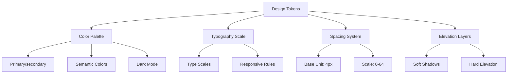
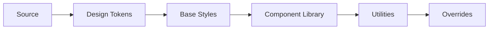
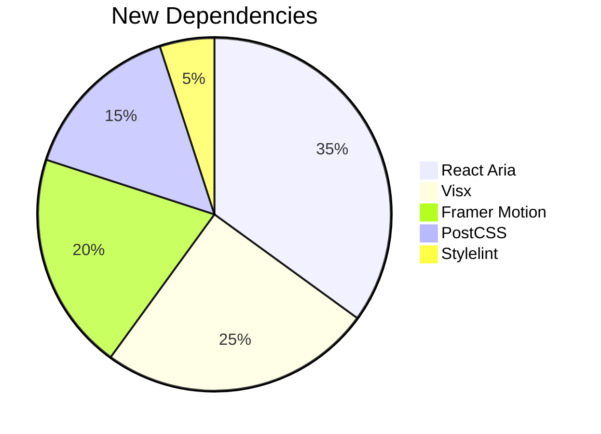

# UI Modernization Plan

## 1. Design System Foundation

## 2. Component Enhancement Roadmap

| Priority | Component Group       | Key Improvements                  | Timeline |
|----------|-----------------------|-----------------------------------|----------|
| P0       | Data Inputs           | Unified validation states         | Week 1   |
| P0       | Navigation            | Persistent sidebar                | Week 2   |
| P1       | Data Visualization    | Responsive charts                 | Week 3   |
| P1       | Tables                | Virtual scrolling                 | Week 4   |
| P2       | Micro-interactions    | Loading states                    | Week 5   |

## 3. Technical Implementation

### Style Architecture

### Dependency Plan

## 4. Implementation Checklist

- [ ] Create design token documentation
- [ ] Set up PostCSS pipeline
- [ ] Implement React Aria hooks
- [ ] Configure Visx chart themes
- [ ] Add motion design system
- [ ] Establish accessibility baseline
